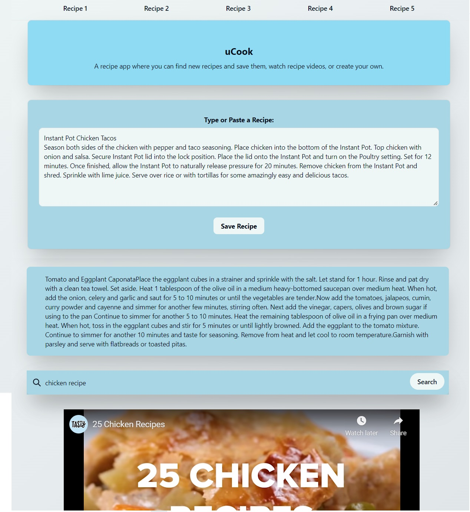

# uCook

# Description
***   PLEASE NOTE: This app is no longer deployed. The API keys it used for YouTube Data API and Recipe Database API have been deactivated.   ***

This is a recipe app where you can find new recipes and save them, watch recipe videos, or create your own. This application uses Tailwind CSS, jQuery, dynamically updated HTML and CSS, and third-party APIs.

## Table of Contents
- [Usage](#usage)
- [Screenshot](#screenshot)
- [License](#license)
- [Contact](#contact)

## Usage

You can save recipes by typing or pasting them into the text area and clicking "Save recipe". You can save up to five different recipes by clicking the tabs at the top of the page. These saved recipes use localStorage to persist on the page, even after refresh.

Underneath the "Save recipe" button there is a random recipe from the Recipe Database API. This recipe will be different each time the page is loaded or refreshed. If you find a recipe you like, you can copy it and paste it into the text area to save it.

Below the random recipe, there is a YouTube Search Bar, which uses the YouTube Data API. If you enter a search query into it and click the "Search" button, then the iFrame underneath will show the first result from your search.

## Screenshot

## License
This project is licensed under the MIT License.  
https://www.mit.edu/~amini/LICENSE.md

## Contact
GitHub: https://github.com/jroller33  
